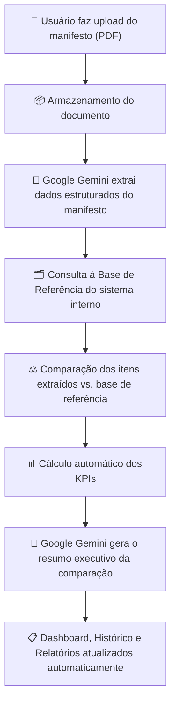

# CargoGuardian AI

### Centro de Controle de Manifesto

**Leitura Automática de Manifesto de Carga via Inteligência Artificial**

**🔗 Aplicação:** [testehackathon.lovable.app](https://cargoguardian.lovable.app/)

---

## Índice

- [Sobre o Desafio](#sobre-o-desafio)
- [Sobre o Projeto](#sobre-o-projeto)
- [Funcionalidades](#funcionalidades)
- [Arquitetura da Solução](#arquitetura-da-solução)
- [Tecnologias Utilizadas](#tecnologias-utilizadas)
- [Perfis de Acesso](#perfis-de-acesso)
- [Como Acessar](#como-acessar)
- [Galeria da Aplicação](#galeria-da-aplicação)
- [Equipe](#equipe)
- [Conclusão](#conclusão)

---

## Sobre o Desafio

Este projeto foi desenvolvido para o **Hackathon Power Developers**, promovido pela **Kodie Academy** em parceria com a **Wilson Sons**, realizado em julho de 2026.

### O problema

Hoje, a Wilson Sons confere manifestos de carga (*Bill of Lading*) de forma manual: uma pessoa precisa ler o documento e cruzar, item a item, com a base de referência do sistema interno. É um processo repetitivo, sujeito a erro humano e que consome tempo que poderia ser direcionado a atividades de maior valor.

### A proposta do desafio

Desenvolver uma solução que aplique **Inteligência Artificial** para automatizar essa conferência — extraindo os itens declarados no manifesto e comparando-os com a base de referência, sinalizando com clareza divergências, itens faltantes ou incorretos.

### Objetivos formais do desafio

| # | Objetivo |
|---|---|
| 1 | Reduzir o tempo de conferência manual de manifestos de carga |
| 2 | Aumentar a confiabilidade da triagem inicial de divergências |
| 3 | Demonstrar a aplicação prática de IA em um processo real de logística portuária |
| 4 | Consolidar competências de IA, automação e low-code |

### Escopo do desafio

| Dentro do escopo | Fora do escopo |
|---|---|
| Um tipo de manifesto de carga, definido pela organização | Integração com sistemas reais da Wilson Sons (Tecsys ou similares) |
| Amostra reduzida de manifestos, representativa do formato real | Processamento de manifestos de todos os tipos de carga e rotas |
| Base de referência simplificada, representando o sistema interno | Validação legal ou aduaneira do documento |
| Extração e comparação automatizada dos itens de carga | — |

---

## Sobre o Projeto

O **CargoGuardian AI** é a solução desenvolvida pela nossa equipe para responder integralmente ao desafio proposto: uma plataforma que recebe um manifesto de carga, utiliza Inteligência Artificial para extrair as informações do documento, compara automaticamente com a base de referência oficial e apresenta o resultado em um painel executivo, claro e compreensível — mesmo para um usuário não técnico.

Mais do que atender aos requisitos mínimos, o projeto foi construído com padrão **Enterprise SaaS**: identidade visual própria, controle de acesso por perfil, dashboard executivo e operacional, central de analytics, histórico auditável e geração de relatórios profissionais — pensado para se parecer com um módulo interno oficial da Wilson Sons, pronto para uso diário por operadores logísticos.

### O que a aplicação resolve

- ✅ Recebe o manifesto de carga (PDF) como entrada
- ✅ Utiliza IA para extrair os itens de carga declarados no documento
- ✅ Compara os itens extraídos com a base de referência (sistema interno simplificado)
- ✅ Sinaliza com clareza divergências, itens faltantes e itens incorretos
- ✅ Trata corretamente o caso de controle (manifesto 100% aderente à base, sem falso positivo)
- ✅ Apresenta o resultado de forma visual, em um dashboard compreensível para qualquer usuário

---

## Funcionalidades

<table>
<tr>
<td width="50%" valign="top">

**Autenticação e Acesso**
- Login obrigatório (usuário/e-mail + senha)
- Recuperação de senha e "permanecer conectado"
- Dois perfis de acesso: Gestor e Colaborador
- Convite de novos usuários por e-mail

**Upload e Análise**
- Upload de manifesto via drag and drop
- Validação automática de formato e integridade do arquivo
- Timeline de processamento em tempo real (extração, validação, comparação, KPIs, resumo)

**Dashboard**
- KPIs operacionais, de qualidade, de IA e executivos
- Gráficos de conformidade, criticidade e distribuição por categoria
- Resumo executivo gerado por IA

</td>
<td width="50%" valign="top">

**Histórico e Auditoria**
- Registro de todas as análises realizadas (nunca sobrescritas)
- Versionamento por BL (manifesto reprocessado gera nova versão)
- Comparação lado a lado entre análises
- Trilha de auditoria completa (upload, processamento, exportação)

**Analytics e Relatórios**
- Modo executivo (visão gerencial) e modo operacional (visão detalhada)
- Exportação em PDF, Excel, CSV e JSON
- Compartilhamento de relatórios por e-mail com membros da equipe

**Configurações**
- Gestão de acessos e permissões
- Visualização da Base de Referência (somente leitura)
- Visualização da Base Operacional (histórico de manifestos processados)

</td>
</tr>
</table>

---

## Arquitetura da Solução

O fluxo de dados segue exatamente o caminho proposto no desafio — **Upload → Extração via IA → Comparação → Sinalização** — implementado com uma arquitetura de serviços organizada e escalável.

### Princípio de uso da IA

Um ponto de arquitetura importante do CargoGuardian AI: **a IA nunca é responsável pela regra de negócio.** O Google Gemini é utilizado exclusivamente para duas tarefas:

1. **Extrair** as informações estruturadas do manifesto (PDF → JSON);
2. **Gerar o resumo executivo**, com base no resultado da comparação já realizada pela aplicação.

Toda a lógica de comparação, cálculo de divergências e KPIs é executada pelo próprio sistema — garantindo resultados consistentes, auditáveis e sem dependência de interpretação da IA sobre os dados internos.

### Modelo de dados (resumo)

| Entidade | Finalidade |
|---|---|
| `USERS` | Usuários da aplicação e seus perfis de acesso |
| `MANIFESTS` | Cada manifesto processado, com scores e status |
| `CONTAINERS` | Contêineres vinculados a cada manifesto |
| `ITEMS` | Itens de carga extraídos de cada manifesto |
| `REFERENCE_ITEMS` | Dados importados da base de referência oficial |
| `ANALYSIS` | Cada execução de conferência (tempo, modelo de IA, custo) |
| `VALIDATIONS` | Cada comparação campo a campo (esperado x encontrado) |
| `AUDIT_LOG` | Registro de eventos (upload, processamento, erro, exportação) |

---

## Tecnologias Utilizadas

| Camada | Tecnologia | Papel na solução |
|---|---|---|
| Interface e construção da aplicação | **Lovable** | Construção da aplicação completa: telas, fluxos, componentes e design system |
| Extração de dados via IA | **Google Gemini** | Leitura do manifesto (PDF) e extração estruturada dos itens de carga |
| Banco de dados e backend | **Supabase** (PostgreSQL) | Persistência de manifestos, análises, validações, usuários e auditoria, com Row Level Security |
| Frontend | **React + TypeScript** | Camada de componentes, tipagem forte de todo o domínio da aplicação |
| Base de referência | **Planilha (XLSX)** | Fonte oficial da "base do sistema interno" utilizada nas comparações |

> A aplicação segue a stack sugerida no guia do desafio (Low-code builder + IA + automação + base de dados), consolidada em uma arquitetura única e coesa dentro do Lovable + Supabase + Gemini.

---

## Perfis de Acesso

| Perfil | Pode |
|---|---|
| **Gestor** | Gerenciar usuários, convidar novos usuários, alterar permissões, visualizar Configurações, gerar relatórios, Analytics, Dashboard, Histórico |
| **Colaborador** | Dashboard, Analytics, Histórico, realizar análises, gerar relatórios — **não** pode gerenciar usuários, alterar permissões ou convidar usuários |

---

## Como Acessar

**Aplicação:** [https://testehackathon.lovable.app/](https://cargoguardian.lovable.app/)

Para a banca avaliadora testar a aplicação, um usuário de teste está disponível:

| Campo | Valor |
|---|---|
| Usuário | `teste.1` |
| Senha | `Teste@01` |
| Perfil | Gestor |

O acesso à planilha que serve como base de dados/base de referência está disponível dentro da própria aplicação, em:

> **Configurações** (menu lateral) → **Base Operacional**

---

## Galeria da Aplicação

<!-- Substitua os placeholders abaixo pelos prints da aplicação -->

### Tela de Login

### Dashboard

### Upload e Timeline de Processamento

### Detalhes da Análise (Drawer de Divergências)

### Analytics

### Histórico de Análises

---

## Equipe

Projeto desenvolvido pela equipe **Power Developers** no Hackathon Kodie Academy × Wilson Sons:

| Integrante |
|---|
| **Ewerton Hecsley** |
| **Renato Filho** |
| **Talia Lira** |
| **Gabriella Morais** |
| **Lais Mendes** |

Cada integrante contribuiu ativamente na construção do CargoGuardian AI — da definição da arquitetura de dados e da engenharia de prompt para extração via IA, ao design system, aos fluxos de UX e à validação funcional da aplicação. O resultado reflete um trabalho verdadeiramente colaborativo, em que decisões de produto, engenharia e experiência do usuário caminharam juntas do primeiro protótipo até a versão final apresentada à banca.

---

## Conclusão

O **CargoGuardian AI** nasceu de um problema real e recorrente na operação portuária da Wilson Sons — a conferência manual, repetitiva e sujeita a falhas de manifestos de carga — e se propôs a resolvê-lo com uma solução que vai além do mínimo exigido pelo desafio.

Ao longo do desenvolvimento, a equipe evoluiu a aplicação por fases — da arquitetura de dados à integração com IA, passando pelo design system, pelo motor de KPIs e Business Intelligence, até o polimento final de produção — sempre com um critério em mente: que o resultado parecesse um software Enterprise, de uso diário, e não um projeto de hackathon.

O CargoGuardian AI entrega exatamente o que o desafio propôs — leitura automática do manifesto via IA, comparação confiável com a base de referência e sinalização clara de divergências — em uma experiência pensada tanto para o operador que realiza a conferência quanto para o gestor que precisa de uma visão executiva rápida da situação. Mais do que uma prova de conceito, este projeto representa o esforço conjunto da equipe em transformar um problema operacional real em uma solução tecnológica madura, escalável e pronta para gerar valor imediato à Wilson Sons.

---

**CargoGuardian AI** · Kodie Academy × Wilson Sons · Power Developers · Julho 2026

